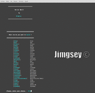

Script Build CLI
======
 
 [](https://github.com/jimgsey)


- This **script** allow you to automate the compilation of roms more easily on CLI platform.

## Works on

* Pc linux
* Jenkins
* Other platforms that can execute script under parameters.

#### Credits

* All my thanks to [Daniml3](https://github.com/daniml3) . He was the original creator and who has been helping at all times with this project.


## Version 
* Version 1

# Supported ROMs:

**//** [Aicp](https://github.com/AICP/platform_manifest/tree/p9.0) 
**//** [Aex](https://github.com/AospExtended/manifest/tree/9.x) 
**//** [Altair](https://github.com/AltairROM/android) 
**//** [Aokp](https://github.com/AOKP/platform_manifest) 
**//** [Aosip](https://github.com/AOSiP/platform_manifest/tree/pie) 
**//** [Arrow](https://github.com/ArrowOS/android_manifest/tree/arrow-9.x) 
**//** [Candy](https://github.com/CandyRoms/candy/tree/c9.0) 
**//** [Carbon](https://github.com/CarbonROM/android/tree/cr-7.0) 
**//** [Colt](https://github.com/Colt-Enigma/platform_manifest/tree/wip)
**//** [Corvus](https://github.com/Corvus-OS/android_manifest)
**//** [Cosmic](https://github.com/Cosmic-OS/platform_manifest/tree/corona-release)
**//** [Cosp](https://github.com/cosp-project/manifest)
**//** [CrDroid](https://github.com/crdroidandroid/android/tree/9.0) 
**//** [Derpfest](https://github.com/DerpFest-Pie/platform_manifest)
**//** [Dot](https://github.com/DotOS/manifest) 
**//** [Floko](https://github.com/FlokoROM/manifesto) 
**//** [Havoc](https://github.com/Havoc-OS/android_manifest/tree/pie)
**//** [Ion](https://github.com/i-o-n/manifest/tree/pie)
**//** [Lineage](https://github.com/LineageOS/android/tree/lineage-16.0) 
**//** [Lotus](https://github.com/LotusOS/android_manifest)
**//** [Nitrogen](https://github.com/nitrogen-project/android_manifest/tree/p)
**//** [Paranoid](https://github.com/AOSPA/manifest/tree/pie)
**//** [Reloaded](https://github.com/ReloadedOS/android_manifest/tree/pie)
**//** [Renouveau](https://github.com/RenouveauOS/android) 
**//** [Revenge](https://github.com/RevengeOS/android_manifest/tree/r9.0-caf)
**//** [Resurrection Remix](https://github.com/RR-Test/platform_manifest) 
**//** [Stag](https://github.com/StagOS/manifest/tree/p9)
**//** [Stalix](https://github.com/StatiXOS/android_manifest/tree/9-caf)
**//** [Viper](https://github.com/ViperOS/viper_manifest/tree/pie)
**//** [Xenon HD](https://github.com/TeamHorizon/platform_manifest)
**//** [Xtended](https://github.com/Project-Xtended/manifest/tree/xp)  **//**


## Parameters

**SCRIPTROM**
```
[aicp] Aicp
[aex] Aex
[altair] Altair
[aokp] AOKP
[aosip] Aosip
[arrow] Arrow
[candy] Candy
[carbon] Carbon
[colt] Colt
[corvus] Corvus
[cosmic] Cosmic
[cosp] COSP
[crdroid] CrDroid
[derpfest] Derpfest
[dot] Dot
[floko] Floko
[havoc] Havoc
[ion] Ion
[lineage] Lineage
[lotus] Lotus
[nitrogen] Nitrogen
[paranoid] Paranoid
[reloaded] Reloaded
[renouveau] RenouveauOS
[revenge] RevengeOS
[resurrection Remix] 
[stag] Stag
[stalix] StatiX
[viper] Viper
[xenon] Xenon HD
[xtended] Xtended

```
**SCRIPTSYNC**
```
Yes / No
```
**BUILDROM**
```
Yes / No
```
**UPLOADROM**
```
Yes / No
```
**ROMCLEAN**
```
[Make] Make Clean
[Delete] Delete folder
[No] No
```

## Instructions for Script

* You need to have CLI installed in your pc o remote. 

* Clone this repository to your local harddrive: 

```
$ git clone git@github.com:jimgsey/Script_Build_CLI.git
 
```

* Change the routes and parameters of the roms to adapt it to your needs.

* Just run build.sh (bash build.sh) or ./build.sh

## Contact

* [Github](https://github.com/jimgsey) 
* [Homepage](https://telegra.ph/Jimgseys-web-01-11)
* [Telegram](https://t.me/Jimgsey)
* [XDA Forum](https://forum.xda-developers.com/member.php?u=8384085)
* [Donate](http://paypal.me/jimgsey)

## Copyright 

> Copyright (c) 2020 Jimgsey


                    
                    

